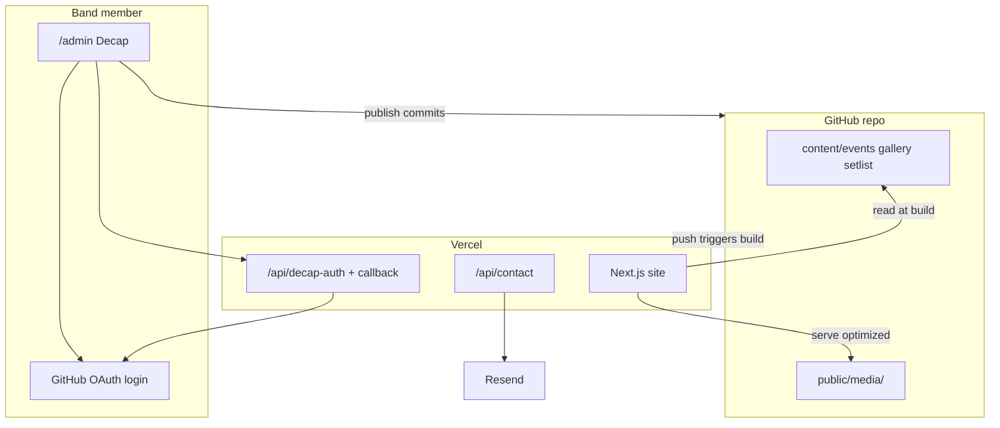

# R2-Live — Decap CMS + Next.js Media Plan

## Decision summary

| Layer | Choice |
|-------|--------|
| **Site** | Next.js 15 (App Router) + TypeScript + Tailwind + Framer Motion |
| **Hosting** | Vercel + GitHub |
| **CMS** | **Decap CMS** at `/admin` — GitHub backend, **no DecapBridge** |
| **Editor auth** | GitHub login (band member gets repo write access; no manual git) |
| **Decap-managed content** | Events, gallery (per band), setlist + **MP3/MP4 uploads** to repo |
| **Static / dev-managed** | Band descriptions, members, hero video URLs, artists, venues, reviews, legal, contact details |
| **Media delivery** | **Next.js** (`next/image`, `sizes`, blur placeholders) — not Cloudinary |
| **Contact** | Resend (email) |
| **Language** | German |

**Existing asset:** [`assets/r2-live/logo.svg`](assets/r2-live/logo.svg)

---

## Architecture



**Publish flow:** Edit in Decap → commit to `main` → Vercel rebuild (~1–3 min) → optimized images served via `next/image`.

---

## Page structure (unchanged from original design)

Single scrollable [`app/page.tsx`](app/page.tsx) with dual-brand top half and shared bottom half.

**Band-specific (top):** Hero, Über uns, Die Band, Galerie, Repertoire — same layout for `r2-live` and `katg`, content switched via sticky navbar + sweep animation.

**Shared (bottom):** Künstler, Termine, Spielorte, Stimmen, Kontakt, Footer → navbar hides via `IntersectionObserver` on `#gemeinsam`.

**Legal:** [`app/impressum/page.tsx`](app/impressum/page.tsx), [`app/datenschutz/page.tsx`](app/datenschutz/page.tsx) — static MD/JSON in repo (dev-edited).

---

## Decap configuration

### File layout

```
public/
  admin/
    index.html          # Decap entry
    config.yml          # collections + media settings
  media/
    gallery/
      r2-live/          # band gallery uploads
      katg/
    setlist/
      r2-live/          # mp3/mp4 uploads
      katg/
content/
  events/               # one .md or .json per event
  setlist/
    r2-live/            # metadata + media path refs
    katg/
```

### Collections in `config.yml`

| Collection | Folder | Editable fields |
|------------|--------|-----------------|
| **Termine** | `content/events` | `title`, `venue`, `location`, `date`, `time`, `ticketUrl`, `published` |
| **Galerie R2-Live** | `content/gallery/r2-live` | `image` (widget), `caption`, `order` |
| **Galerie KATG** | `content/gallery/katg` | same |
| **Repertoire R2-Live** | `content/setlist/r2-live` | `title`, `originalArtist`, `audio` (file, optional), `video` (file, optional), `order` |
| **Repertoire KATG** | `content/setlist/katg` | same |

### Media guardrails (Decap-side)

```yaml
media_library:
  config:
    max_file_size: 5242880   # 5 MB — applies to default Git media library

media_folder: public/media
public_folder: /media
```

**Upload limits by type (document in admin hint + `config.yml` labels):**

| Type | Decap widget | Recommended limit | Note |
|------|--------------|-------------------|------|
| Gallery JPEG/WebP | `image` | 5 MB (`max_file_size`) | Phone photos OK if not RAW |
| Setlist MP3 | `file` + `media_extension` filter | 5 MB | ~3–4 min audio at 128kbps |
| Setlist MP4 | `file` | 5 MB | Short clips only; large video bloats Git |

If 5 MB is too tight for MP4, raise `max_file_size` cautiously (e.g. 10 MB) — every byte lives in Git forever.

**No DecapBridge:** `backend` uses GitHub + Vercel OAuth proxy (below). Band member needs a **GitHub account** with **write** access to the repo.

### GitHub backend + OAuth (Vercel)

1. Create **GitHub OAuth App** — callback: `https://<production-domain>/api/decap-callback`
2. Add Vercel env vars: `GITHUB_CLIENT_ID`, `GITHUB_CLIENT_SECRET`, `DECAP_OAUTH_REDIRECT_URI`
3. Implement Next.js routes (pattern from [Decap backends docs](https://decapcms.org/docs/backends-overview/)):
   - [`app/api/decap-auth/route.ts`](app/api/decap-auth/route.ts) — redirect to GitHub authorize
   - [`app/api/decap-callback/route.ts`](app/api/decap-callback/route.ts) — exchange code, `postMessage` to admin popup
4. `config.yml` backend block:

```yaml
backend:
  name: github
  repo: owner/r2-live
  branch: main
  base_url: https://<production-domain>
  auth_endpoint: api/decap-auth
```

**Note:** OAuth typically works on **production domain** only; local dev may use `local_backend: true` in `config.yml` for filesystem edits without GitHub.

---

## Next.js media handling (your request)

Decap stores **originals** in `public/media/`. Next.js optimizes **delivery** — not upload-time processing.

### 1. `next/image` everywhere

Create [`components/ui/OptimizedImage.tsx`](components/ui/OptimizedImage.tsx):

- Wraps `next/image` with consistent `sizes`, `quality` (e.g. 80), `placeholder="blur"` where available
- Gallery grid passes responsive `sizes`: `(max-width: 768px) 100vw, (max-width: 1200px) 50vw, 33vw`
- Hero images: `priority` + `fill` + `object-cover`

### 2. `next.config` image config

In [`next.config.ts`](next.config.ts):

- `formats: ['image/avif', 'image/webp']`
- Tune `deviceSizes` / `imageSizes` for gallery breakpoints
- No remote patterns needed (local `/media/...` paths)

### 3. Blur placeholders at build time

[`lib/images.ts`](lib/images.ts) using `sharp` (already bundled with Next.js):

- `getBlurDataURL(src: string)` — read image from `public/`, generate tiny base64 blur
- Used in gallery/hero for better LCP perception
- Run during static page data loading (build time), not in Decap

### 4. Setlist audio/video (not `next/image`)

- **MP3:** native `<audio controls preload="metadata">` pointing to `/media/setlist/...`
- **MP4:** `<video controls preload="metadata" playsInline>` — same path
- Optional: lightweight player component in [`components/bands/SetlistPlayer.tsx`](components/bands/SetlistPlayer.tsx)
- No transcoding pipeline in v1 — files served as uploaded; **size cap in Decap** is the main guardrail

### 5. Editor-facing guidance

Short German note in Decap `config.yml` `display_url` / collection `summary` / README for band:

- Gallery: JPG/WebP, max 5 MB, ideally already rotated/cropped
- Audio: MP3 preferred
- Video: short clips only; prefer external YouTube embed in static hero if full songs

### What Next.js does **not** do in this stack

- No automatic resize on upload (Decap default has no pipeline)
- No repo cleanup of old media (orphaned files stay until manual Git cleanup)
- Cloudinary/Uploadcare intentionally skipped for lowest maintenance

---

## Content loading in Next.js

[`lib/content/`](lib/content/) reads Decap output at **build time**:

| Reader | Source | Used by |
|--------|--------|---------|
| `getEvents()` | `content/events/*` | Termine section |
| `getGallery(band)` | `content/gallery/{band}/*` | Galerie |
| `getSetlist(band)` | `content/setlist/{band}/*` | Repertoire |
| `getStaticBandData(band)` | `content/bands/{band}.json` (dev-edited) | Hero, About, Members |

Parse frontmatter with `gray-matter` or JSON directly. Sort by `order` / `date`. Filter `published: false` on events.

**Revalidation:** Content changes trigger Vercel deploy via Git push — no webhook ISR needed. Site is fully static after build (fast, low maintenance).

---

## Project structure

```
r2-live/
├── app/
│   ├── layout.tsx
│   ├── page.tsx
│   ├── impressum/page.tsx
│   ├── datenschutz/page.tsx
│   └── api/
│       ├── decap-auth/route.ts
│       ├── decap-callback/route.ts
│       └── contact/route.ts
├── public/
│   ├── admin/
│   │   ├── index.html
│   │   └── config.yml
│   ├── logos/
│   └── media/
├── content/
│   ├── events/
│   ├── gallery/{r2-live,katg}/
│   ├── setlist/{r2-live,katg}/
│   └── bands/              # static JSON per band
├── components/
│   ├── navbar/BandNavbar.tsx
│   ├── bands/                # Hero, Gallery, SetlistPlayer, ...
│   ├── shared/
│   ├── animations/
│   └── ui/OptimizedImage.tsx
└── lib/
    ├── content/
    ├── images.ts
    └── bands.ts
```

---

## Contact form (unchanged)

[`app/api/contact/route.ts`](app/api/contact/route.ts) — Resend, Zod, honeypot, DSGVO checkbox → `/datenschutz`.

Env: `RESEND_API_KEY`, `CONTACT_TO_EMAIL`.

---

## Implementation phases

### Phase 1 — Foundation
- Scaffold Next.js 15 + TS + Tailwind + Framer Motion
- Move logo to [`public/logos/r2-live.svg`](public/logos/r2-live.svg)
- [`lib/bands.ts`](lib/bands.ts) + placeholder `content/bands/*.json`
- Connect GitHub → Vercel

### Phase 2 — Dual-brand UI
- Sticky navbar, sweep transition, `BandProvider`, shared-zone navbar hide
- Band + shared sections with mock/static data
- `OptimizedImage` + `lib/images.ts` blur helper

### Phase 3 — Decap CMS
- `public/admin/` + `config.yml` (collections above)
- GitHub OAuth API routes
- Invite band member to GitHub repo (write access)
- Seed placeholder events, gallery entries, setlist items
- Wire `lib/content/` readers into page sections

### Phase 4 — Shared sections + legal + contact
- Static content for artists, venues, reviews, legal pages
- Resend contact form

### Phase 5 — Assets + launch
- Real photos, MP3 samples, KATG logo
- `max_file_size` tuning if needed
- SEO, `sitemap.xml`, reduced-motion, Lighthouse (target good LCP on gallery)
- Custom domain on Vercel

### Phase 6 — Reusable template (future SMB sites)
- Extract Decap `config.yml` patterns + `lib/content/` + OAuth routes into a **site-starter** repo
- Per client: fork → new GitHub repo → OAuth app → Vercel — no Supabase/Neon/Blob

---

## Environment variables

| Variable | Purpose |
|----------|---------|
| `GITHUB_CLIENT_ID` | Decap OAuth |
| `GITHUB_CLIENT_SECRET` | Decap OAuth |
| `DECAP_OAUTH_REDIRECT_URI` | `https://<domain>/api/decap-callback` |
| `RESEND_API_KEY` | Contact form |
| `CONTACT_TO_EMAIL` | Band inbox |

---

## Testing checklist

- [ ] `/admin` — GitHub login works on production domain
- [ ] Add event → commit → deploy → appears in Termine (sorted by date)
- [ ] Upload gallery image → visible after deploy, served as WebP/AVIF via `next/image`
- [ ] Upload MP3 → plays in Repertoire; over-limit file rejected by Decap
- [ ] `max_file_size` blocks oversized gallery upload with clear error
- [ ] Dual-brand switch + navbar hide still work
- [ ] Contact form + legal pages work
- [ ] `prefers-reduced-motion` disables sweep

---

## Estimated effort

| Phase | Time |
|-------|------|
| 1–2 Foundation + UI | 1–2 days |
| 3 Decap + OAuth + content wiring | 1 day |
| 4 Shared + contact + legal | 1 day |
| 5 Assets + polish | 1–2 days |
| **Total** | **~4–6 days** |

---

## Risks to accept (by design)

- **Deploy delay** after edits (1–3 min) — tell band member once
- **Git repo growth** from media — mitigate with 5 MB cap + MP3 over MP4
- **GitHub account required** for editor (no DecapBridge)
- **No upload-time resize** — Next optimizes display only

When you say **start building**, Phase 1–3 proceed in [`r2-live`](.) (repo currently: logo + old [`project.plan.md`](project.plan.md) only).
